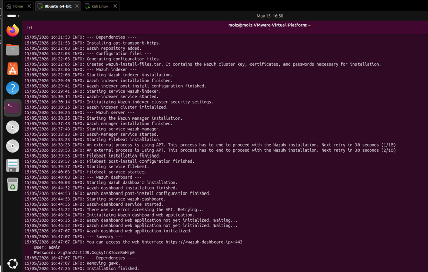
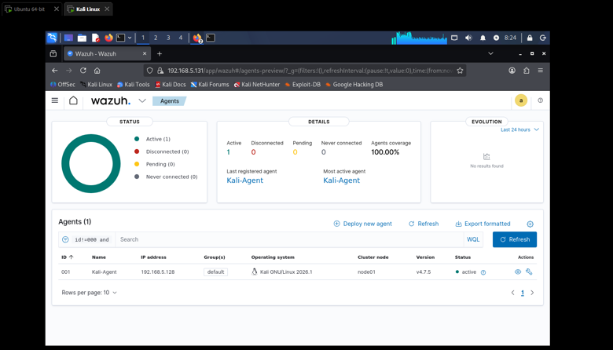
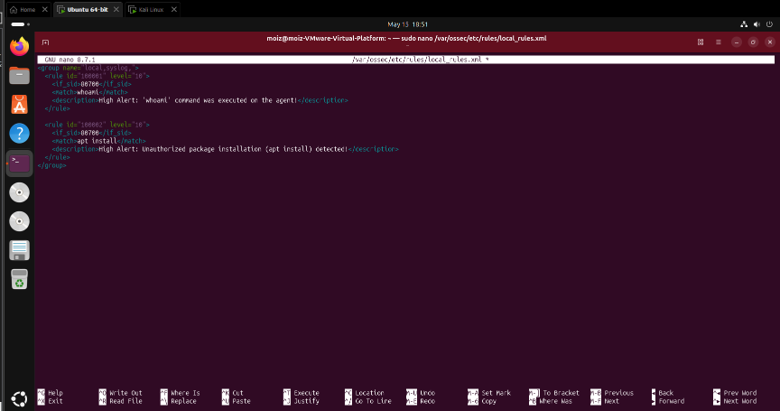
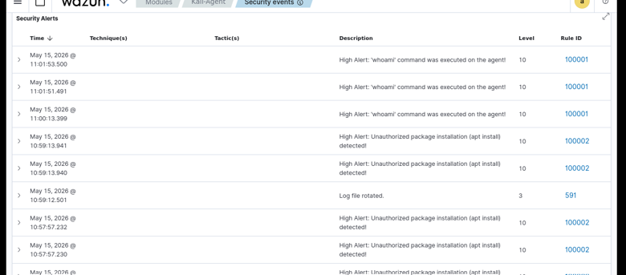

# Wazuh SIEM Deployment & Custom Rule Engineering

Hands-on security engineering repository focused on deploying Wazuh SIEM, registering endpoint agents, and engineering custom detection rules to catch specific threat behaviors.

---

## 🛠️ Project Overview & Objectives
* **Objective:** Deploy a central Wazuh Manager on an Ubuntu VM, connect a Kali Linux Wazuh Agent, and engineer Custom Detection Rules (Level 10) to monitor high-risk system commands like `whoami` and `apt install`.
* **Environment:** 
  * **Wazuh Manager:** Ubuntu 22.04 VM
  * **Wazuh Agent:** Kali Linux VM
* **Primary Tool:** Wazuh SIEM

---

## 📂 Repository Contents
* **`images/`**: Contains core verification screenshots documenting the deployment and rule triggering process.
* **[`Wazuh_Rule_Engineering_Steps.pdf`](Wazuh_Rule_Engineering_Steps.pdf)**: Comprehensive documentation detailing step-by-step implementation, configuration files, and testing methodologies for learning and reference.

---

## 🚀 Step-by-Step Implementation Guide

### Step 1: Wazuh Manager Installation (Ubuntu)
* Deployed the central Wazuh Manager using the forced installation script and saved the admin credentials.
* Identified the Manager's IP address (`192.168.5.131`) to prepare for agent enrollment.

### Step 2: Wazuh Agent Deployment & Connection (Kali Linux)
* Downloaded and installed the Wazuh agent package on the Kali Linux target machine, pointing it to the Manager's IP.
* Verified the active status of the agent service and confirmed successful enrollment on the Wazuh Dashboard.

### Step 3: Custom Rule Engineering (Manager)
* Configured the Kali agent to forward Auditd logs via `ossec.conf`.
* Created custom XML detection rules in `local_rules.xml` (Rule IDs **100001** for `whoami` and **100002** for `apt install`) with a **Level 10** severity rating.

### Step 4: Alert Validation & Monitoring
* Executed target commands on the Kali agent (`whoami` and `apt update && apt install`) to test the detection pipeline.
* Verified real-time Level 10 security alerts on the Wazuh dashboard interface.

---

## 📊 Summary & Conclusion
* **SIEM Integration:** Successfully established an end-to-end telemetry and monitoring pipeline from the endpoint agent to the central manager.
* **Threat Detection:** Demonstrated effective custom rule engineering by catching unauthorized package installations and reconnaissance commands in real-time.
